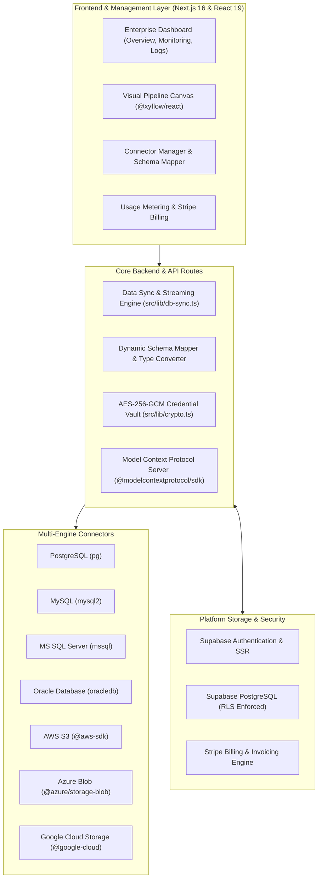

# 🔄 DataEcho

> **Enterprise Hybrid Data Migration, Real-Time Replication & AI-Orchestrated ETL Pipeline Platform**  
> Move, transform, and synchronize databases and cloud data warehouses across on-premises environments and multi-cloud infrastructure.

---

## 👨‍💻 Creator & Credits

- **Creator & Lead Architect:** **Dr. Timothy Tok**
- **Project:** **DataEcho**
- **Repository:** [https://github.com/drtim83/DataEcho](https://github.com/drtim83/DataEcho)

---

## 🌟 Key Features

### 1. 🔌 Multi-Engine Enterprise Connectors
- **Relational & Enterprise Databases:** Native high-throughput drivers for **PostgreSQL** (`pg`), **MySQL** (`mysql2`), **Microsoft SQL Server** (`mssql`), and **Oracle Database** (`oracledb`).
- **Cloud Object Storage & Data Lakes:** Bi-directional sync and extraction across **Amazon S3** (`@aws-sdk/client-s3`), **Azure Blob Storage** (`@azure/storage-blob`), and **Google Cloud Storage** (`@google-cloud/storage`).
- **Modern Cloud Native:** Built-in connection management and schema discovery for **Supabase** databases with automated health checks and SSL validation.

### 2. 🎨 Visual DAG Pipeline Canvas (React Flow)
- **Interactive Drag-and-Drop Workflow:** Powered by `@xyflow/react` (React Flow), allowing data engineers to assemble complex extraction, transformation, and load graphs visually.
- **Advanced Topology:** Supports multi-source inputs, conditional branching (*if/else* routing), multi-column joins, type casting, and multi-destination dispatching.
- **Dynamic Schema Inspection:** Live introspection of source tables, column data types, foreign keys, and preview sampling before launching sync tasks.

### 3. 🤖 Model Context Protocol (MCP) AI Agent Engine
- **Autonomous Agent Tooling:** Built on `@modelcontextprotocol/sdk`, exposing enterprise database queries, schema discovery, pipeline orchestration, and health diagnostics to AI agents.
- **Dual MCP Deployments:** Embedded Next.js API endpoints (`/api/mcp`) and a dedicated standalone Node.js MCP server runtime (`agent/src/index.ts`).

### 4. ⚡ Flexible Sync Modes & Change Data Capture (CDC)
- **Full Snapshot Replication:** Bulk extract and parallel stream insert with batch chunking and backpressure control.
- **Incremental Watermarking:** Tracks timestamps, sequence IDs, and row versions to synchronize only delta records with minimal network overhead.
- **Fail-Safe Retries:** Automatic exponential backoff, transaction rollbacks on failure, and comprehensive sync run logs.

### 5. 🛡️ Enterprise Security & AES-256 Encryption
- **Encrypted Credential Vault:** All database passwords, connection strings, service account keys, and cloud tokens are encrypted at rest using **AES-256-GCM** before database storage.
- **Row-Level Security (RLS):** End-to-end Supabase RLS policies ensuring strict multi-tenant isolation across organizations, connectors, and audit trails.

### 6. 👥 Team Collaboration & Role-Based Access Control (RBAC)
- **Granular Permissions:** Preconfigured roles (**Admin**, **Data Engineer**, and **Viewer**) with dedicated team management views (`/team`).
- **Immutable Audit Logging:** Every schema change, credential update, pipeline execution, and user login is recorded in immutable audit tables (`/logs`).

### 7. 💳 Stripe Usage-Based Metering & Subscription Billing
- **Real-Time Metering:** Live calculation of processed rows, data volume (GB), and connector execution time (`/metering`).
- **Stripe Integration:** Seamless payment method onboarding via Stripe Elements (`SetupIntent`) and automated tier billing.

### 8. 📊 Centralized Telemetry & Observability
- **Operational Dashboard:** Real-time visibility into active connector health, sync run statuses, throughput, and error rates (`/monitor`).
- **Cron Scheduler:** Native pipeline scheduling engine for recurring intervals (hourly, daily, custom cron expressions).

---

## 🏛️ System Architecture

DataEcho is architected for high resilience, security, and extensibility:



### Module Breakdown

1. **`src/app/` (Next.js 16 App Router & Dashboard)**
   - `(dashboard)/canvas/page.tsx`: Interactive React Flow DAG pipeline designer.
   - `(dashboard)/connectors/page.tsx`: Database and cloud storage credential configuration.
   - `(dashboard)/monitor/page.tsx`: Real-time streaming status, run durations, and sync history.
   - `(dashboard)/schema/page.tsx`: Automated schema detection and column mapping interface.
   - `(dashboard)/metering/page.tsx`: Row consumption and data throughput tracker.
   - `(dashboard)/logs/page.tsx`: Immutable audit event viewer.
   - `api/pipelines/`: RESTful endpoints for CRUD, canvas graph topology, and execution triggers.
   - `api/connectors/`: Connection testing, credential verification, and schema reflection.
   - `api/mcp/`: REST & SSE transport for Model Context Protocol agents.

2. **`src/lib/` (Core Libraries)**
   - `db-sync.ts`: Core streaming engine handling batch reads, transform buffers, and write upserts.
   - `crypto.ts`: AES-256-GCM encryption/decryption utilities.
   - `schema-mapper.ts`: Cross-database type translation (e.g. Oracle `NUMBER` to PG `NUMERIC`).
   - `stripe.ts` & `pricing.ts`: Usage metering and billing tiers.

3. **`agent/` (Dedicated MCP Agent Server)**
   - Standalone Node.js service exposing DataEcho tools (database queries, sync triggering, pipeline inspection) to external AI agents (e.g. Claude Desktop, Cursor, Antigravity).

4. **`supabase/migrations/` (Database Schema & Security)**
   - SQL migrations defining pipelines, connectors, audit logs, team roles, and strict Row-Level Security (RLS) policies.

---

## 💻 Tech Stack

| Domain | Technology / Library | Purpose |
| :--- | :--- | :--- |
| **Framework** | Next.js 16.2.10 + React 19.2.4 | Server components, streaming responses, App Router architecture |
| **Styling** | Tailwind CSS v4 + PostCSS | Modern high-performance styling with enterprise dark/light themes |
| **Language** | TypeScript 5.x | End-to-end type safety for data models and schema reflection |
| **Pipeline Canvas** | `@xyflow/react` ^12.11.2 | Interactive DAG graph editor for visual ETL orchestration |
| **Relational Drivers** | `pg`, `mysql2`, `mssql`, `oracledb` | Native drivers for PostgreSQL, MySQL, SQL Server, and Oracle |
| **Cloud Object Storage** | AWS S3, Azure Blob, Google Cloud Storage | Native enterprise cloud SDKs for data lake extraction & loading |
| **AI Integration** | `@modelcontextprotocol/sdk` ^1.29.0 | Model Context Protocol server exposing data operations to AI |
| **Database & Auth** | Supabase (`@supabase/ssr`, `@supabase/supabase-js`) | Multi-tenant auth, session middleware, and RLS-protected storage |
| **Payments & Billing** | Stripe (`stripe`, `@stripe/stripe-js`) | Subscription lifecycle and metered data volume billing |
| **Encryption** | Node.js `crypto` (AES-256-GCM) | Hardware-accelerated credential encryption at rest |

---

## 🚀 Getting Started & Local Development

### Prerequisites
- **Node.js**: v20.x or higher
- **Package Manager**: npm
- **Supabase Account / Local CLI**: For database & authentication
- **Stripe Account (Optional)**: For billing integration

### 1. Clone & Install
```bash
git clone https://github.com/drtim83/DataEcho.git
cd DataEcho
npm install
```

### 2. Environment Configuration
Copy `.env.local.example` to `.env.local` and provide your credentials:
```bash
cp .env.local.example .env.local
```
Fill in the required variables:
- `NEXT_PUBLIC_SUPABASE_URL` & `NEXT_PUBLIC_SUPABASE_ANON_KEY`
- `SUPABASE_SERVICE_ROLE_KEY`
- `ENCRYPTION_KEY` (32-byte hex string for AES-256 credential encryption)
- `STRIPE_SECRET_KEY` & `NEXT_PUBLIC_STRIPE_PUBLISHABLE_KEY` (if billing enabled)

### 3. Apply Supabase Database Migrations
Run the SQL migration files located in `supabase/migrations/` in sequential order via the Supabase Dashboard SQL Editor or Supabase CLI:
```bash
supabase db push
```

### 4. Run the Development Server
```bash
npm run dev
```
Open [http://localhost:3000](http://localhost:3000) in your browser.

---

## 🤖 Running the Standalone MCP Agent Server

DataEcho includes a dedicated Model Context Protocol (MCP) server allowing AI assistants to manage and query your data pipelines:

```bash
cd agent
npm install
npm run build
npm start
```
Configure your AI client (e.g., Claude Desktop, Antigravity) with:
```json
{
  "mcpServers": {
    "dataecho": {
      "command": "node",
      "args": ["/path/to/DataEcho/agent/dist/index.js"],
      "env": {
        "DATAECHO_API_URL": "http://localhost:3000",
        "DATAECHO_API_KEY": "<YOUR_API_KEY>"
      }
    }
  }
}
```

---

## 📄 License & Credits

Designed and developed by **Dr. Timothy Tok**.  
All rights reserved.
